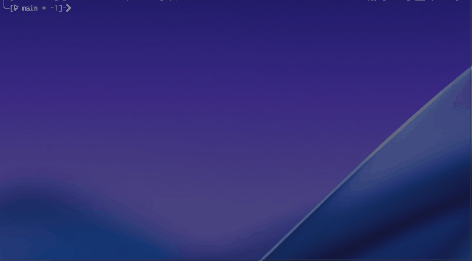

# 📌 Huffman 
허프만 무손실 압축 알고리즘을 STL없이 클래스화 하였습니다. 
μ„ 알고리즘은 간단하고 효율적인데다가 텍스트 압축에 특히 강력한 성능을 보입니다. 
단, 전체 문자의 빈도를 분석해야 하므로 실시간 처리는 불리할 수 있습니다. 
허프만 압축 알고리즘은 현재 PNG 이미지 포맷이나 ZIP, MP3 등의 포맷에서 응용되고 있습니다.
 
### 📥 Installing 
현재 페이지 상단에 위치한 초록색 버튼(<> code)μ„ 누르면 [Download Zip] 항목을 확인하실 수 있습니다. 
설치가 반드시 필요한 것은 아니며 원하는 항목을 확인하고 해당 항목을 누르면 소스 코드 원본을 확인하실 수 있습니다. 
 
### ▶️ Executing program 
- None 
  
## 𑤠Authors 
- stdsic — @https://github.com/stdsic/Huffman 
  
